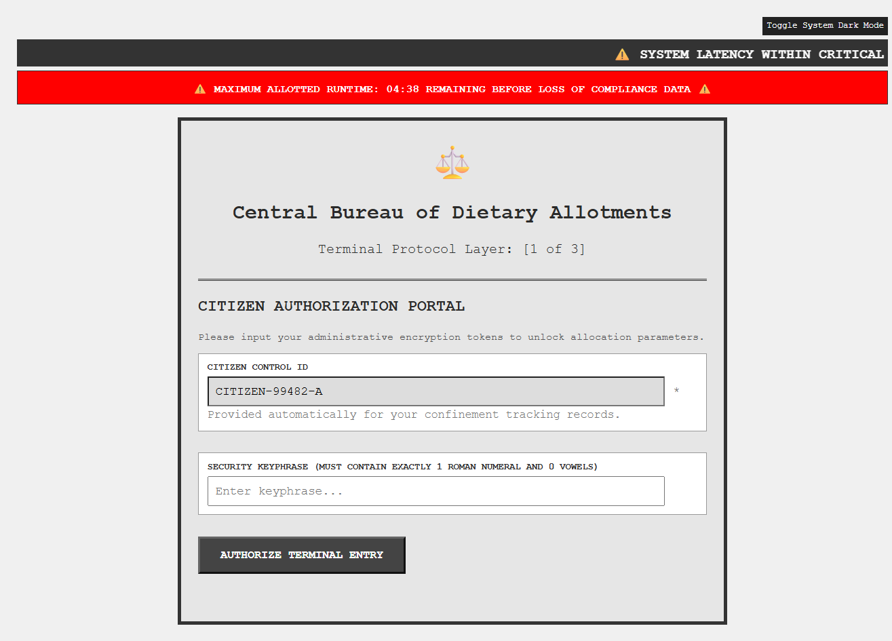
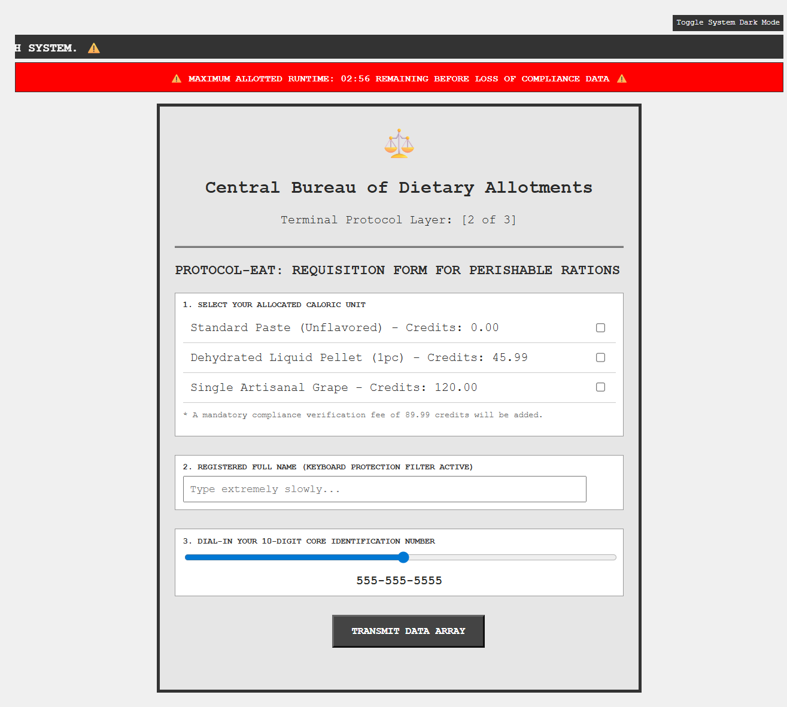
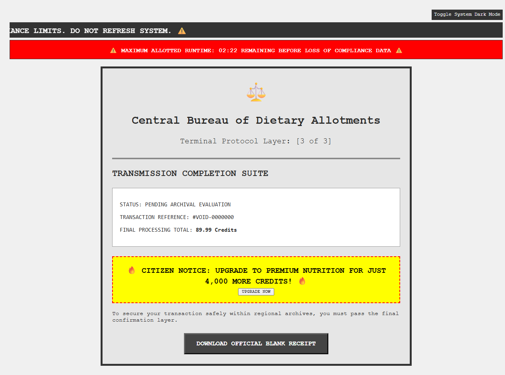

# Unhinged UI-UX Crimes 🚨💀

> _“A carefully engineered collection of UI/UX crimes against humanity.”_

GovGulp is a fully functional, highly distressing administrative terminal simulation built for the Unhinged UI / UX Crimes challenge hosted by Sheryians Coding School.

## 🌐 Quick Links

- 🌐 Live Demo: [View Project](https://hinaldhameshiya07.github.io/Unhinged-UI-UX-Crimes/)
- 📂 GitHub Repo: [Repository](https://github.com/hinaldhameshiya07/Unhinged-UI-UX-Crimes)
- 🎥 Project Video: [Watch Here](https://drive.google.com/drive/folders/1OZ79uThDaKFVxOmsDao5p2D4qrMJhk6A?usp=sharing)

## 📌 About The Project

**Unhinged UI-UX Crimes** is a deliberately cursed web experience designed to showcase the absolute worst possible user interface and user experience decisions imaginable.

From:

- fake urgency timers ⏳
- dystopian government portals 🏛️
- inaccessible forms 😵
- confusing layouts 🌀
- manipulative UI patterns 🚫
- absurd validation rules 🤡

…this project is a collection of intentional design disasters built for fun, learning, and chaos.

 

## 🎭 Project Theme

A dystopian parody website that intentionally weaponizes terrible UX practices for comedy and experimentation.

GovGulp is a fake joke website designed to be intentionally terrible and frustrating for fun — like a digital haunted house for UI/UX.

 

## 🖼️ Preview

### Terminal Protocol Layer – 1/3

### Protocol-EAT Form – 2/3

### Transmission Completion Suite – 3/3

 

## ✨ Features

## ☠️ Major UI/UX Crimes

1. **Artificial Urgency**  
Fake timers and warnings create unnecessary stress and pressure.

2. **Forced Interactions**  
Pointless confirmations interrupt the user workflow.

3. **Impossible Input Rules**  
Absurd validation requirements make forms frustrating to complete.

4. **Input Throttling**  
The site punishes users for typing too fast.

5. **Hidden Fees**  
Mandatory compliance charges manipulate pricing and break trust.

6. **Fake Service Options**  
Delivery choices are intentionally deceptive and useless.

7. **Aggressive Upselling**  
Intrusive premium popups constantly distract users.

8. **Confusing Feedback**  
Loading states and system messages provide no clear progress or transparency.

 

## 🛠️ Tech Stack

- HTML5
- CSS3
- JavaScript

 

## 🎯 Purpose

This project was built to:

- Experiment with creative frontend design
- Learn about bad UX patterns
- Explore dystopian interface aesthetics
- Practice storytelling through UI
- Create intentionally uncomfortable user experiences

 

## 📚 Learning Outcomes

- Advanced CSS styling
- DOM manipulation
- UX psychology experimentation
- Interactive frontend logic
- Creative storytelling through UI

 

## 💡 Inspiration

Inspired by:

- Analog horror aesthetics
- Dark UX patterns
- Early internet weirdness

 

## ⚠️ Warning

This project intentionally violates many modern UI/UX best practices. Please do **NOT** use these patterns in real production systems unless your goal is:

- confusing users,
- increasing anxiety,
- or getting roasted by designers online.

 

## ⚠️ Disclaimer

- This project is satire and created purely for entertainment and frontend experimentation. No real services, payments, or government systems exist.
